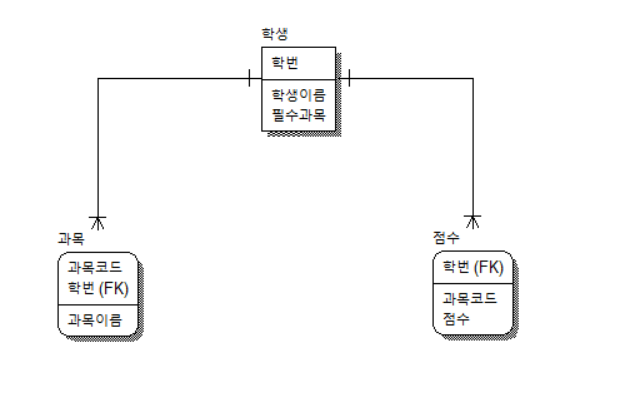

### 학점 계산 콘솔 프로그램

### 주제
학생 과목별 학점을 major, basic으로 구분하여 계산하는 콘솔 프로그램을 작성한다. 
과목은 수학, 국어 두 과목으로 구성된다. 
컴공과 학생의 major는 수학, 국문과 학생의 major는 국어이다.
major 과목은 s-f 형식의 학점 부여 방식을 적용하고, 
basic 과목은 a-f 형식의 학점 부여 방식을 적용한다. 
과목이 추가되거나 채점 방식을 수정하기 쉽도록 객체지향적인 자바 코드를 작성하시오.

### 클래스 관계도 
- 학생은 한 개 이상의 과목을 수강한다.
- 학생은 반드시 한 개 이상의 과목 점수를 가진다.


### 패키지 
1. 학교(school)
- 학생
- 과목
- 성적
- 인스턴스 생성

```
클래스: 집을 짓기 위한 설계도
객체: 설계도에 따라 지어진 집 
프로그래밍에서 객체의 의미는 클래스에 정의된 내용대로 메모리에 생성된 것을 의미한다. 
```

2. 공통(utils)
- 공통코드

3. 성적(grade)
- basic 학점 계산 
- major 학점 계산
- 학점 인터페이스 

4. 리포트(report)
- 학생정보 및 학생별 점수정보를 콘솔에 출력할 템플릿

5. 실행(test)
- 학교 정보 생성, 리포트 생성

### OOP(Object Oriented Programming)

- 추상화(Abstraction)
컨텍스트와 관련이 없는 정보를 숨기거나 관련된 정보만 알 수 있도록 함
- 캡슐화(Encapsulation)
관련이 있는 변수와 함수를 하나의 클래스로 묶어 외부에서 쉽게 접근하지 못하도록 함
필드, 메서드로만 접근가능 (직접 수정 불가) 
- 상속(Inheritance)
하나의 클래스가 부모 클래스의 속성과 행동을 얻음
코드의 재사용성과 유지보수 측면의 장점이 있음 
- 다형성(polymorphism)
같은 자료형에 여러가지 객체를 대입하여 다양한 결과를 얻어내는 성질
동일한 이름의 여러 형태의 메소드 생성 가능 

### OOP 모범 사례 
1. 상속보다 유연성이 높은 인터페이스 사용
2. 코드 반복 대신 추상화 사용 
3. 향후 변경 가능성이 있는 코드를 캡슐화 
4. SOLID 원칙 준수